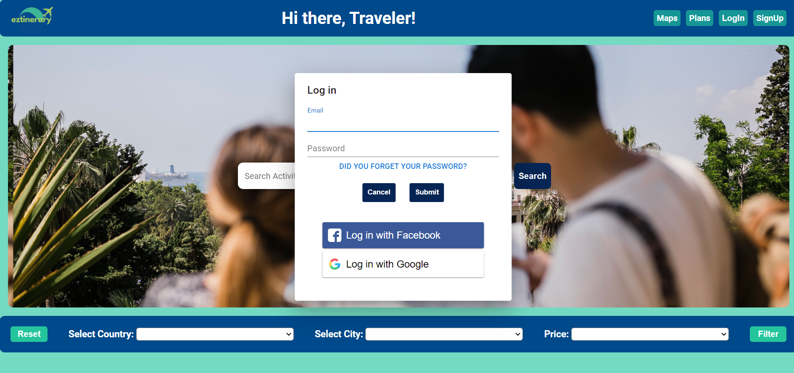
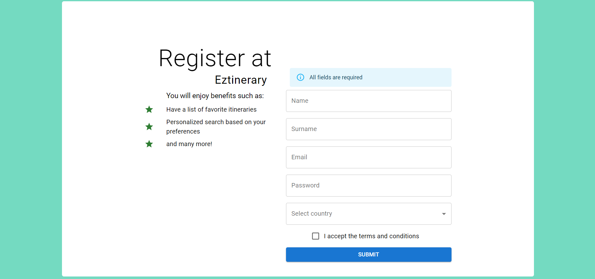
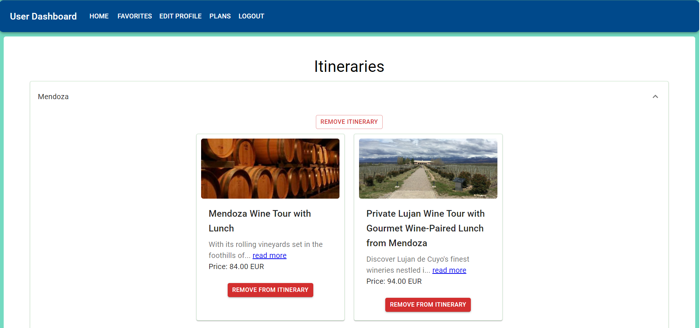
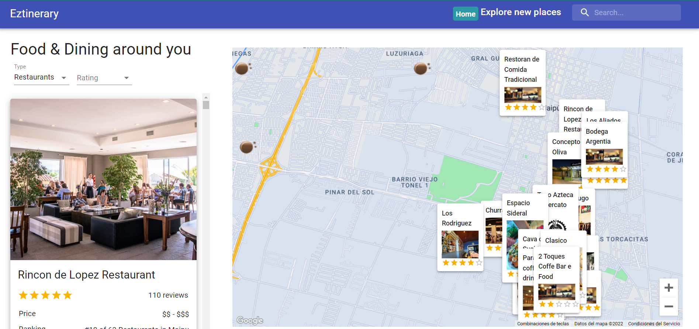
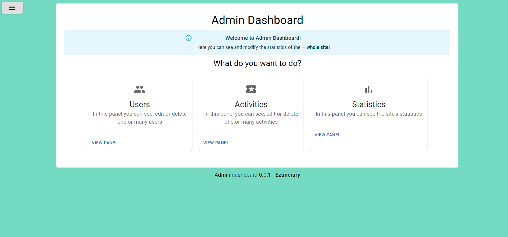

# Eztinerary

Proyecto grupal de HENRY

  Eztinerary es una página web donde podemos ver actividades turísticas para realizar en nuestro viaje por Latinoamérica. Cuenta con un sistema de registro y verificación de cuenta a través de Gmail. Podemos iniciar sesión de forma manual, con Facebook o con Google. 

Este sitio nos permite guardar actividades en nuestro perfil, ver detalles y reservarlas. También cuenta con un mapa de Google donde podemos ver restaurantes cercanos a nuestra ubicación de GPS. 

Para las empresas que quieran publicitar sus actividades en nuestro sitio contamos con 3 tipos de suscripciones, cada una de las cuales dependiendo del precio varía el alcance y los beneficios de la misma. El método para realizar el pago es a través de PayPal. 

Además, la página cuenta con un dashboard para el administrador de la cuenta, desde el cual se puede ver diferentes tipos de estadísticas de la página importantes para el sitio, agregar o quitar actividades y agregar o eliminar usuarios. 

 

Herramientas utilizadas: 

-- Front-end: HTML, CSS, JavaScript, React, Redux, Material Ui y sweetalert. 

-- Back-end: Node js, Typescript, Express, MongoDB, Passport y JWT. 

Inicio

 

LogIn

 

Registro

 

Dashboard Usuario

 

Mapa

 

Dashboard Administrador

